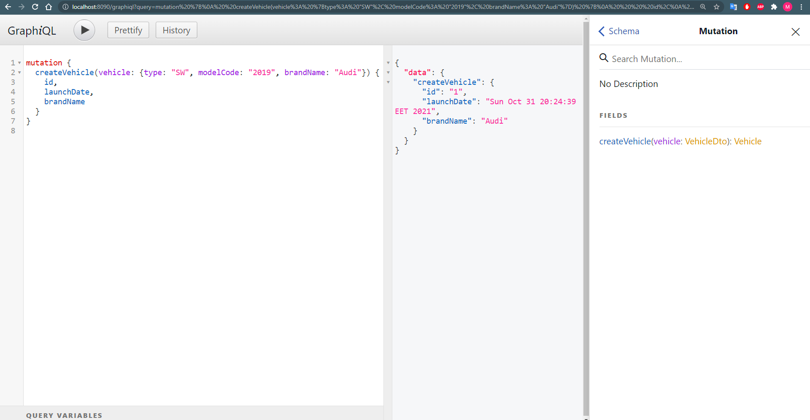
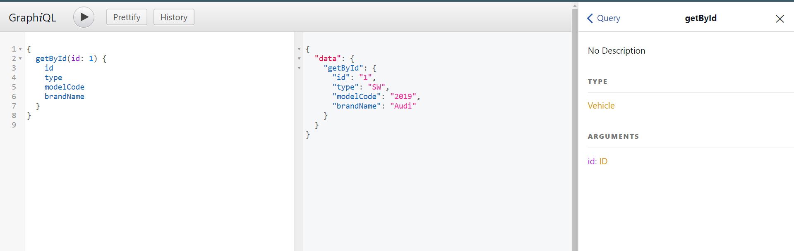
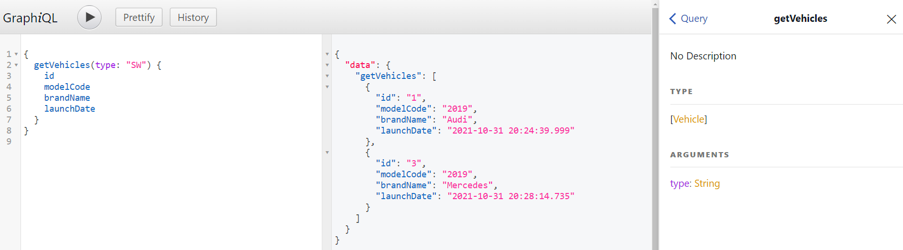
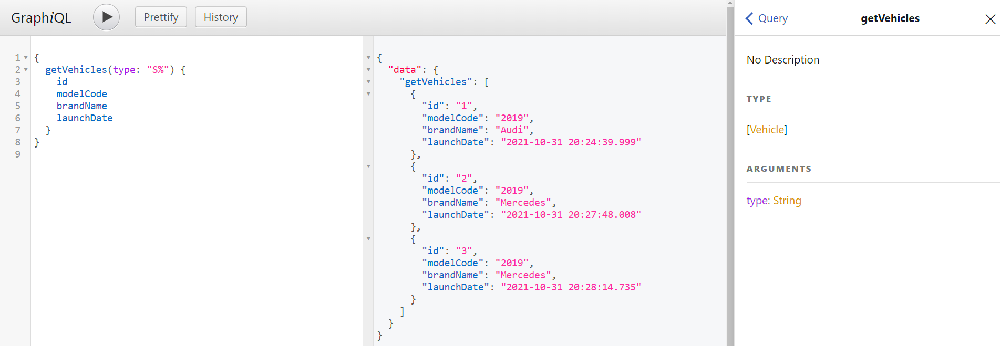

# Mutation
```graphql
mutation {
    createVehicle(vehicle: {
        type: "SW", modelCode: "2019", brandName: "Mercedes"
    })
    {
        id,
        launchDate,
        brandName
    }
}
```


---
# Query

```graphql
query {
    getById(id: 1) {
        id
        type
        modelCode
        brandName
        launchDate
    }
}
```



---

```graphql
query {
    getVehicles(type: "SW") {
        id
        modelCode
        brandName
        launchDate
    }
}
```



---
```graphql
query {
    getVehicles(type: "S%") {
        id
        modelCode
        brandName
        launchDate
    }
}
```

